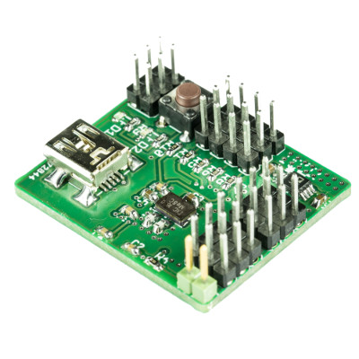

<a href="https://lxrobotics.com/"></a>
💾 RC Mixer
===========

The LXRobotics P20 RC Mixer is a device which can mix up to 4 standard RC PWM inputs (pulse period 20 ms, pulse duration 1-2 ms) to up to 6 standard RC PWM outputs applying any used definable control algorithm.

# 📸 Image



## 💻 Installation

* Install the Arduino IDE

```
sudo apt-get install arduino
```
* Clone this repository

```
git clone https://github.com/aentinger/rcmix
```

## 💻 Building

* Open project in Arduino IDE by left clicking on `rcmixarduino.ino`

* Select ATMega32U4 MCU via the menu `Tools - Board - Arduino Leonardo`

* Compile with `Ctrl+R`

## 💻 Upload

* Connect an **AVR ISP mkII** with the rcmix hardware
 
* After successful compilation of the Arduino sketch select `Tools - Programmer - AVRISP mkII`
 
* Upload with `Ctrl+U`
